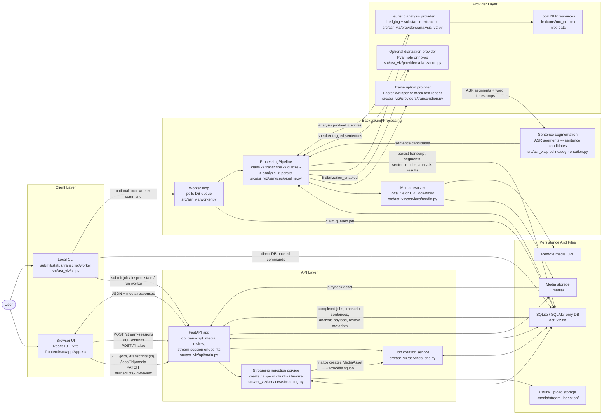
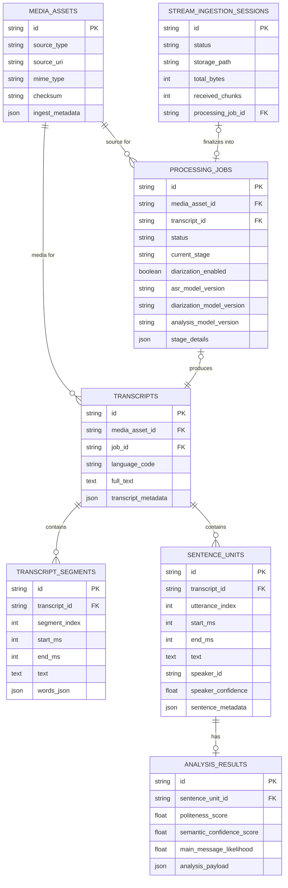

# System Architecture

This diagram reflects the current implementation in the repository across the frontend, FastAPI backend, background worker, storage layer, and model/provider integrations.

## Runtime Architecture

## Core Persistence Model

## Notes

- The frontend is a separate Vite app that consumes the backend API; FastAPI is not serving the SPA bundle in this repository.
- Streaming ingestion is upload-and-finalize, not live incremental ASR.
- Diarization is conditional: the worker uses Pyannote only when diarization is enabled and a Hugging Face token is configured.
- URL-based media sources are downloaded into `.media/` on demand before transcription.
